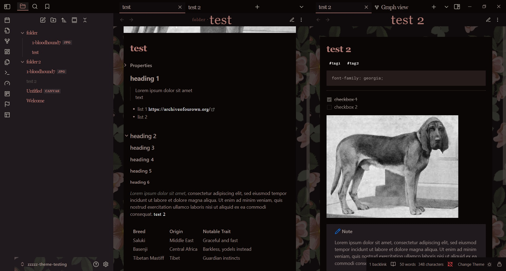
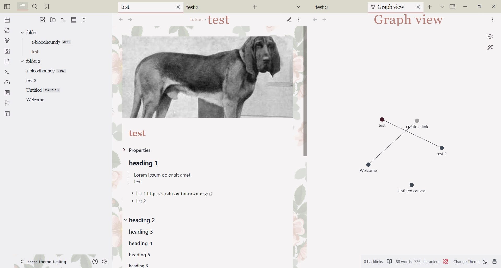

# Antique Flowers

### Using this theme with banners and certain plugins

I wanted to make sure that this theme works properly with the types of banners most people use. But due to its unique layout, certain styling-changing plugins might still cause issues. Keep this in mind when using this theme. 
It has been tested with common banner plugins such as pixel banner and even the old abandoned banners plugin.
Thanks to Kapirklaa for helping with this.
If you need to use a certain plugin with this theme and notice issues with the layout, you can post it on my github and we will try to find a solution.

### Modes

Dark mode:

Light mode:

